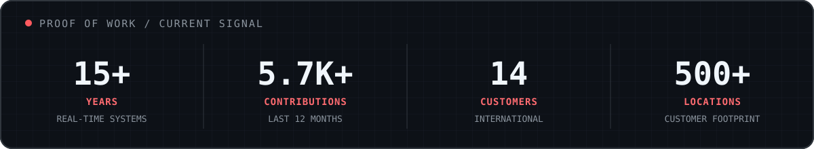

# AI copilots for the physical world.

I'm Sebastián Rojo, CTO and co-founder of [EmiliaVision](https://emiliavision.com). We turn cameras and real-time signals into useful action for frontline teams.

**[We're hiring a Founding Engineer in Colombia →](https://torre.ai/post/xWpKxq6r-emilia-ai-founding-engineer-2)**

## Building where software meets reality

The physical world is hostile to software: networks disappear, cameras move, hardware varies, and reality refuses to match the training data. A promising model is only the beginning—the system must create useful outcomes every day in real businesses.

> **Turn ambiguity into experiments, experiments into shipped systems, and failures into better judgment.**

## The working relationship

| What I value | What Emilia offers |
|---|---|
| High agency and closed loops | Broad, end-to-end ownership |
| Hacker curiosity with production judgment | Direct access to founders and users |
| Evidence over prolonged debate | Fast feedback from real systems |
| Learning velocity over pedigree | Influence over architecture and culture |

## Selected builds

<table>
<tr>
<td width="50%"></td>
<td width="50%"></td>
</tr>
<tr>
<td width="50%"></td>
<td width="50%"></td>
</tr>
</table>

<strong>How I build and the builders I want to work with</strong>

 

I like small teams with high trust, short feedback loops, and end-to-end ownership.

- Start from the real problem, not the fashionable technology.
- Find the shortest path to evidence; prototype, measure, and then harden.
- Use AI as leverage, not as a substitute for judgment.
- Own the complete loop: problem, code, deployment, observation, and user outcome.
- Move fast without gambling with production.
- Make failures visible and turn them into better systems.

I care less about a perfect résumé or traditional career path than about what you have built, automated, repaired, reverse-engineered, contributed to, or placed in front of real users.

Before Emilia, I worked on open-source voice AI at [Vocode](https://github.com/vocodedev) and co-founded [Artisan Labs](https://github.com/artisanlabs). I have spent more than 15 years building real-time infrastructure, open-source software, machine learning systems, and products where reliability matters.

## Build with us

We're looking for a **Founding Engineer in Colombia** to work closely with me across AI, product, edge systems, and infrastructure.

Skip the polished cover letter. Send me a project, prototype, postmortem, automation, or repository you are proud of—and tell me what you learned while building it.

**[Read the role and apply](https://torre.ai/post/xWpKxq6r-emilia-ai-founding-engineer-2)** · [arpagon@arpagon.co](mailto:arpagon@arpagon.co?subject=Founding%20Engineer%20at%20Emilia)

[Website](https://arpagon.co) · [LinkedIn](https://www.linkedin.com/in/arpagon/) · [X](https://twitter.com/arpagon)
