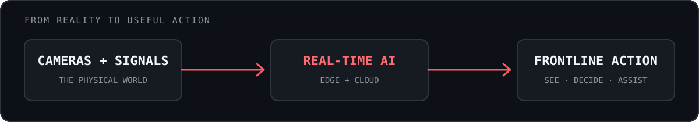
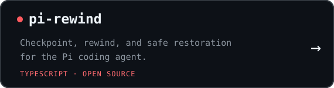
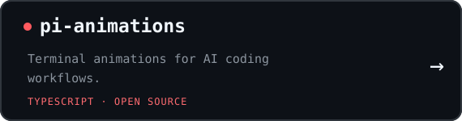
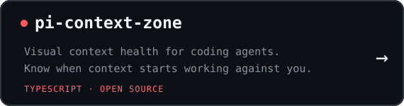
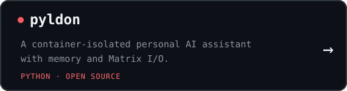

# AI copilots for the physical world.

I'm Sebastián Rojo, CTO and co-founder of [EmiliaVision](https://emiliavision.com). We turn cameras and real-time signals into useful action for frontline teams.

## Building where software meets reality

The physical world is hostile to software: networks disappear, cameras move, hardware varies, and reality refuses to match the training data. A promising model is only the beginning—the system must create useful outcomes every day in real businesses.

> **Turn ambiguity into experiments, experiments into shipped systems, and failures into better judgment.**

## Operating principles

| Principle | In practice |
|---|---|
| Start from reality | Solve the user's problem, not the fashionable abstraction |
| Find the shortest path to evidence | Prototype, instrument, observe, and then harden |
| Own the complete loop | Problem, code, deployment, operation, and outcome |
| Move fast with judgment | Speed matters; production is not a casino |

## Selected builds

<table>
<tr>
<td width="50%"></td>
<td width="50%"></td>
</tr>
<tr>
<td width="50%"></td>
<td width="50%"></td>
</tr>
</table>

<strong>A longer note on how I build</strong>

 

I like small teams with high trust, short feedback loops, and end-to-end ownership.

- Start from the real problem, not the fashionable technology.
- Find the shortest path to evidence; prototype, measure, and then harden.
- Use AI as leverage, not as a substitute for judgment.
- Own the complete loop: problem, code, deployment, observation, and user outcome.
- Move fast without gambling with production.
- Make failures visible and turn them into better systems.

I enjoy working with people who are curious enough to inspect the layer below the abstraction, resourceful enough to keep moving when information is incomplete, and responsible enough to know that hacker mindset is not an excuse for reckless engineering.

Before Emilia, I worked on open-source voice AI at [Vocode](https://github.com/vocodedev) and co-founded [Artisan Labs](https://github.com/artisanlabs). I have spent more than 15 years building real-time infrastructure, open-source software, machine learning systems, and products where reliability matters.

## Elsewhere

[Website](https://arpagon.co) · [LinkedIn](https://www.linkedin.com/in/arpagon/) · [X](https://twitter.com/arpagon) · [Email](mailto:arpagon@arpagon.co)

---

Emilia is growing. If AI, edge systems, and messy real-world problems sound like your kind of work, <a href="https://torre.ai/post/xWpKxq6r-emilia-ai-founding-engineer-2">take a look at what we're building</a>.
